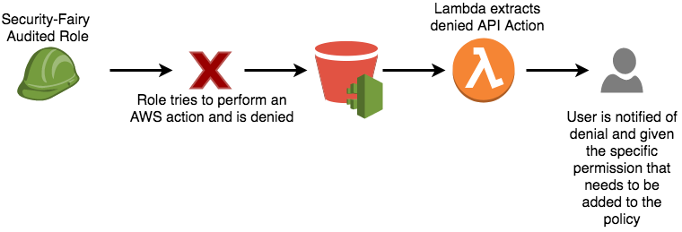

## Scoping Permissions

While IAM is a fantastic way to protect your AWS Resources/Accounts, properly scoping IAM Policies can be very difficult. There are two general approaches to correctly scoping permissions:

1. Granting overly broad permissions to "get things working" and then reining in the permissions later.
1. Running the application and adding permissions one by one (white-listing) as denies crop up.

The first approach is very common and can greatly increase the speed at which development can move. The catch, however, is that "later" often never comes and the user/system retains its overly permissive state.

The second approach is somewhat less common because it can be *extremely* pain-staking. If an application has even a little complexity, this can take a very long time, and that says nothing about the system breaking when a rarely used feature runs into an access denied that wasn't encountered during the initial permission scoping.

To help streamline the process on the AWS, we built a serverless tool that can bring together the benefits of both.

## Security-Fairy
The intention of this tool is to help give developers a **STARTING POINT** to build properly scoped IAM policies that are as minimally permissive as possible.

> This tool is only to be used in a sandbox/dev environment and should **NEVER** be used in Production or other secure environments.

### What this tool will do:
- Create a managed policy for a given AWS Role which contains only the "necessary" set of AWS actions the application needs to function. This is determined by what AWS API actions a given role has taken based on the past X days of CloudTrail Logs.
- The resulting policy will serve as a STARTING POINT for an IAM Policy that can be used in later environments

### What this tool won't do:
- This tool won't add/remove/modify ***inline*** IAM Policies. This tool only handles **Managed IAM Policies**.
- This tool won't build policies which incorporate **IAM Policy Conditionals**.
- This tool won't build policies which incorporate **Resource** specific handling.

## How it works:

Any Role requires IAM Permissions to perform API actions on AWS Resources. As the AWS Resource/User perform API actions using this role, all of those actions are captured by CloudTrail and loaded into an S3 Bucket.

 

Security Fairy aggregates the CloudTrail Logs to build an IAM Policy based off of the actual actions taken by the role during the last X number of days.

The final piece is a lambda function that keeps an eye out for API actions that are denied and gives the user the opportunity to add the missing permission to the Security-Fairy generated policy.

### Prerequisites:
- CloudTrail must be enabled in your account.
- An S3 bucket for the CloudTrail logs to live in.
- Ability to create IAM resources via CloudFormation

### How to use it:

- Deploy the CloudFormation templates from this repo into your AWS Account
- Navigate to the API Gateway URL which is an output of the stack
- Enter the ARN of the AWS Role you want to audit and the number of days the application has been running (or which contains enough log data to form a representative set of the necessary API actions.)
